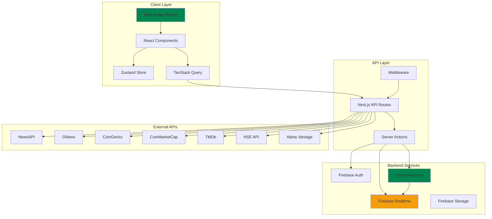
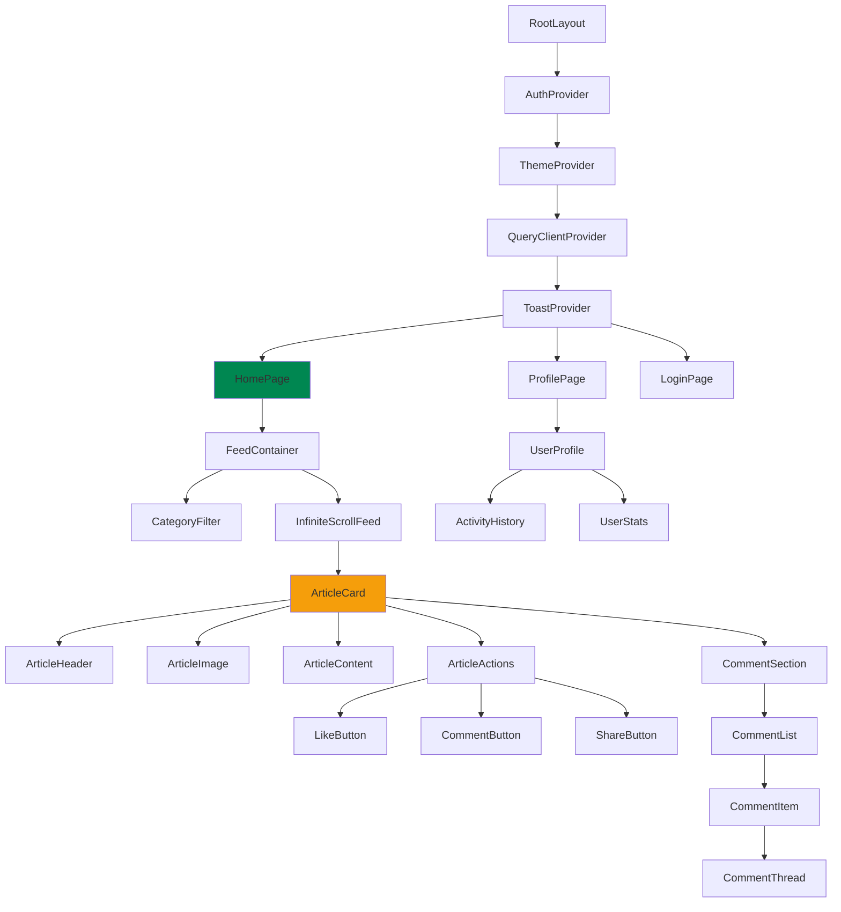

# Design Document: Nigerian News Social Platform

## Overview

The Nigerian News Social Platform is a modern web application that aggregates Nigerian-focused content from multiple news APIs and presents it in an Instagram-style infinite scroll feed with social interaction features. The platform combines content aggregation, real-time social features (likes, comments), and user authentication to create an engaging news consumption experience. Built with Next.js 14+ App Router, TypeScript, and Firebase, the platform emphasizes performance, real-time updates, and a mobile-first design approach with Nigerian cultural aesthetics (green #008751 primary, amber #F59E0B accents).

The system architecture follows a modern JAMstack approach with server-side rendering for SEO, client-side state management for interactivity, and real-time subscriptions for social features. Content is fetched from external APIs (NewsAPI, GNews, CoinGecko, CoinMarketCap, TMDb, NSE API, Alpha Vantage), cached in Cloud Firestore, and served through optimized API routes with rate limiting and pagination.

## Technology Stack

### Phase 1: MVP Stack (Recommended for Initial Launch)

#### Core Framework & Language
- **Next.js 14+** (App Router) - Server-side rendering, React Server Components, optimized routing
- **TypeScript 5.4+** - Type safety, better developer experience, reduced runtime errors
- **React 18+** - Concurrent features, Suspense, automatic batching

#### Styling & UI Components
- **Tailwind CSS 3.4+** - Utility-first CSS, rapid development, small bundle size
- **shadcn/ui** - Accessible, customizable components built on Radix UI primitives
- **Framer Motion 11+** - Production-ready animations, gesture support, layout animations
- **lucide-react** - Modern icon library, tree-shakeable, consistent design
- **clsx + tailwind-merge** - Conditional class names, conflict resolution

#### Backend & Database
- **Firebase** - Complete backend-as-a-service platform
  - Cloud Firestore for NoSQL document database
  - Firebase Realtime Database for real-time subscriptions
  - Firebase Authentication for user management (email/password + social login)
  - Firebase Storage for user avatars and media
  - Firebase Security Rules for data protection
  - Cloud Functions for serverless backend logic

#### State Management
- **TanStack Query v5** - Server state management, caching, optimistic updates, automatic refetching
- **Zustand 4.5+** - Lightweight global UI state (theme, filters, modals)

#### Forms & Validation
- **React Hook Form 7.51+** - Performant form handling, minimal re-renders
- **Zod 3.23+** - TypeScript-first schema validation, type inference

#### Utilities & Developer Experience
- **next-themes** - Theme switching (light/dark mode) with system preference detection
- **react-hot-toast** - Beautiful toast notifications, customizable, accessible
- **react-intersection-observer** - Infinite scroll, lazy loading, viewport detection

#### Deployment & Monitoring
- **Vercel** - Optimized Next.js hosting, edge functions, automatic HTTPS
- **Sentry** - Error tracking, performance monitoring, user feedback

#### Bundle Size (Phase 1)
- **Total:** ~250KB gzipped
- **Initial Load:** <200KB
- **Performance:** Lighthouse score 90+ on mobile

---

### Phase 2: Visual Enhancement Stack (Post-MVP, Optional)

Add these libraries **only after** validating product-market fit and based on user feedback:

#### 3D Graphics & Advanced Animations
- **@react-three/fiber** - React renderer for Three.js, declarative 3D scenes
- **@react-three/drei** - Helpers for cameras, controls, loaders, effects
- **Use cases:** 3D hero section, interactive backgrounds, depth effects

#### Data Visualization (for Crypto/Stocks)
- **lightweight-charts** - TradingView-style charts, performant, mobile-optimized
- **Use cases:** Stock price charts, crypto trends, market data visualization

#### Advanced Animation (if Framer Motion insufficient)
- **GSAP** - Complex timeline animations, scroll-triggered effects
- **Use cases:** Multi-step sequences, parallax scrolling, advanced transitions

#### Bundle Size Impact (Phase 2)
- **Additional:** +150KB gzipped
- **Total:** ~400KB gzipped
- **Trade-off:** Premium visual experience vs. load time on 3G connections

---

### Design Patterns & Techniques

#### Glassmorphism (No Library Required)
Use Tailwind CSS utilities for glass effects:
```tsx
<div className="backdrop-blur-xl bg-white/10 border border-white/20 rounded-2xl shadow-2xl">
  {/* Content */}
</div>
```

#### Bento Grid Layouts (No Library Required)
Use CSS Grid with Tailwind:
```tsx
<div className="grid grid-cols-1 md:grid-cols-2 lg:grid-cols-3 gap-4 auto-rows-[200px]">
  <div className="col-span-2 row-span-2">Large card</div>
  <div>Small card</div>
</div>
```

#### Nigerian Color Palette
- **Primary:** `#008751` (Nigerian Green) - CTAs, active states, brand elements
- **Accent:** `#F59E0B` (Amber) - Highlights, likes, important actions
- **Text:** `#1a1a1a` (Near-black) - Primary text, high contrast
- **Muted:** `#6B7280` (Gray) - Secondary text, metadata
- **Background Light:** `#FFFFFF` (White) - Cards, surfaces
- **Background Dark:** `#111827` (Dark Gray) - Dark mode background

---

### Why Not EJS?

**EJS (Embedded JavaScript Templates) is not recommended** for this project because:

#### Technical Limitations
- **No Real-time Updates:** EJS requires full page reloads; cannot handle Firebase Realtime listeners
- **No Client-side State:** Infinite scroll, optimistic UI updates, and complex interactions require React
- **Manual DOM Manipulation:** Would need jQuery or vanilla JS for interactivity (error-prone, hard to maintain)
- **No Component Reusability:** Every page duplicates HTML, no shared component logic
- **Poor Developer Experience:** No TypeScript support, no hot module replacement, limited tooling

#### Feature Incompatibility
- ❌ Real-time likes/comments (requires Firestore listeners + React state)
- ❌ Infinite scroll (requires client-side pagination state)
- ❌ Optimistic UI updates (requires React mutations)
- ❌ Category filtering without page reload (requires client routing)
- ❌ Theme switching without flicker (requires React context)

#### Modern Alternatives
If React feels too complex, consider:
- **Next.js with Server Components** (Recommended) - Less client JS, still supports interactivity
- **Astro + React Islands** - Mostly static, React only where needed
- **SvelteKit** - Simpler than React, smaller bundle, still supports real-time

**Verdict:** Next.js + React is the right choice for this platform's requirements. It's industry standard for social platforms with real-time features.

---

### Package.json (Phase 1 MVP)

```json
{
  "name": "nigerian-news-social-platform",
  "version": "1.0.0",
  "dependencies": {
    "next": "^14.2.0",
    "react": "^18.3.0",
    "react-dom": "^18.3.0",
    "typescript": "^5.4.0",
    "tailwindcss": "^3.4.0",
    "firebase": "^10.12.0",
    "@tanstack/react-query": "^5.40.0",
    "zustand": "^4.5.0",
    "framer-motion": "^11.2.0",
    "react-hook-form": "^7.51.0",
    "zod": "^3.23.0",
    "lucide-react": "^0.379.0",
    "next-themes": "^0.3.0",
    "react-hot-toast": "^2.4.1",
    "clsx": "^2.1.0",
    "tailwind-merge": "^2.3.0",
    "react-intersection-observer": "^9.10.0"
  },
  "devDependencies": {
    "@types/node": "^20.12.0",
    "@types/react": "^18.3.0",
    "@types/react-dom": "^18.3.0",
    "autoprefixer": "^10.4.19",
    "postcss": "^8.4.38",
    "eslint": "^8.57.0",
    "eslint-config-next": "^14.2.0",
    "prettier": "^3.2.5",
    "prettier-plugin-tailwindcss": "^0.5.14"
  }
}
```

---

## Architecture

### Firestore Data Model

The platform uses Cloud Firestore's document-based NoSQL structure with the following collections and subcollections:

```
users/ (collection)
  {userId}/ (document)
    - username: string
    - email: string
    - avatar_url: string
    - created_at: timestamp
    - total_likes: number (denormalized)
    - total_comments: number (denormalized)

articles/ (collection)
  {articleId}/ (document)
    - title: string
    - source: string
    - published_date: timestamp
    - image_url: string
    - excerpt: string
    - category: string (News | Crypto | Entertainment | Stocks)
    - external_url: string
    - cached_at: timestamp
    - like_count: number (denormalized)
    - comment_count: number (denormalized)
    
    likes/ (subcollection)
      {userId}/ (document)
        - created_at: timestamp
    
    comments/ (subcollection)
      {commentId}/ (document)
        - user_id: string
        - user_name: string
        - user_avatar: string
        - text: string
        - created_at: timestamp
        - parent_comment_id: string | null
        - nesting_level: number (0-2, max 3 levels)
```

**Indexes Required:**
- `articles` collection: Composite index on `(category, published_date DESC)`
- `comments` subcollection: Composite index on `(parent_comment_id, created_at ASC)`

**Security Rules Strategy:**
- Users can read all articles and comments
- Users can only create/delete their own likes and comments
- Only authenticated users can write data
- Article documents can only be created by Cloud Functions (admin)

### System Architecture Overview



### Component Hierarchy



### Data Flow Architecture

```mermaid
sequenceDiagram
    participant U as User
    participant C as Client Component
    participant TQ as TanStack Query
    participant API as API Route
    participant FS as Firestore
    participant EXT as External APIs
    participant RT as Realtime Listener
    
    U->>C: Scroll to load more
    C->>TQ: useInfiniteQuery('articles')
    TQ->>API: GET /api/articles?page=2
    API->>FS: Check cache
    alt Cache miss
        API->>EXT: Fetch from NewsAPI/GNews
        EXT-->>API: Raw articles
        API->>FS: Store in articles collection
    end
    FS-->>API: Paginated articles
    API-->>TQ: Return articles
    TQ-->>C: Update UI
    
    U->>C: Click like button
    C->>TQ: useMutation('likeArticle')
    TQ->>API: POST /api/articles/:id/like
    API->>FS: Add document to likes subcollection
    FS->>RT: Trigger onSnapshot listener
    RT-->>C: Receive realtime update
    C->>C: Update like count optimistically
    API-->>TQ: Confirm success
    TQ-->>C: Finalize UI state


## Correctness Properties

*A property is a characteristic or behavior that should hold true across all valid executions of a system—essentially, a formal statement about what the system should do. Properties serve as the bridge between human-readable specifications and machine-verifiable correctness guarantees.*

### Property 1: Article Data Normalization

*For any* article data structure returned from any External_API (NewsAPI, GNews, CoinGecko, CoinMarketCap, TMDb, NSE API, Alpha Vantage), the normalization function SHALL produce a consistent output schema containing all required fields (title, source, published_date, image_url, excerpt, category, external_url).

**Validates: Requirements 2.8**

### Property 2: API Failure Resilience

*For any* External_API request failure, the System SHALL continue serving cached articles from Firestore without interrupting user access to the feed.

**Validates: Requirements 2.9**

### Property 3: Article Deduplication

*For any* set of articles containing duplicate URLs, the System SHALL store only one instance per unique URL in Firestore.

**Validates: Requirements 2.11**

### Property 4: Article Chronological Ordering

*For any* set of articles with timestamps, the System SHALL display them in reverse chronological order (newest first) such that for all adjacent articles A and B where A appears before B, A.published_date >= B.published_date.

**Validates: Requirements 3.5**

### Property 5: Article Rendering Completeness

*For any* article displayed in the feed, the rendered output SHALL contain all required fields: title, source, published_date, image, excerpt, like_count, and comment_count.

**Validates: Requirements 3.6**

### Property 6: Category Filtering Correctness

*For any* selected category filter and any set of articles, all displayed articles SHALL have a category field matching the selected filter, and no articles with non-matching categories SHALL be displayed.

**Validates: Requirements 4.2**

### Property 7: Category Filter URL Persistence Round-Trip

*For any* valid category selection, persisting it to the URL query parameter and then loading the page with that URL SHALL result in the same category filter being applied.

**Validates: Requirements 4.6, 4.7**

### Property 8: Like Creation and Removal

*For any* user and article pair, clicking the like button SHALL toggle the like state: if no like exists, one SHALL be created in Firestore; if a like exists, it SHALL be removed from Firestore.

**Validates: Requirements 5.1, 5.2**

### Property 9: Like Count Accuracy

*For any* article, the displayed like_count SHALL equal the number of unique user likes stored in Firestore for that article at all times.

**Validates: Requirements 5.3**

### Property 10: Like Button State Consistency

*For any* article, the like button SHALL display in an active visual state if and only if the current user has a like record for that article in Firestore.

**Validates: Requirements 5.5**

### Property 11: Duplicate Like Prevention

*For any* user and article pair, attempting to create multiple likes SHALL result in only one like record existing in Firestore.

**Validates: Requirements 5.8**

### Property 12: Comment Creation and Association

*For any* valid comment text (non-empty, non-whitespace-only) and article, submitting the comment SHALL store it in Firestore with the correct article association and user attribution.

**Validates: Requirements 6.2**

### Property 13: Comment Validation

*For any* string composed entirely of whitespace characters, attempting to submit it as a comment SHALL be rejected and SHALL not create a Firestore record.

**Validates: Requirements 6.3**

### Property 14: Comment Chronological Ordering

*For any* set of comments on an article, the System SHALL display them in chronological order (oldest first) such that for all adjacent comments C1 and C2 where C1 appears before C2, C1.created_at <= C2.created_at.

**Validates: Requirements 6.5**

### Property 15: Reply Parent-Child Relationship

*For any* reply submitted to a parent comment, the System SHALL store it in Firestore with the correct parent_comment_id reference, establishing the Comment_Thread hierarchy.

**Validates: Requirements 6.7**

### Property 16: Comment Thread Display and Nesting Limit

*For any* Comment_Thread structure, the System SHALL display nested replies with visual indentation proportional to nesting depth, and SHALL enforce a maximum nesting depth of 3 levels by preventing replies to comments at level 3.

**Validates: Requirements 6.8, 6.9**

### Property 17: Comment Rendering Completeness

*For any* comment displayed in the comment section, the rendered output SHALL contain all required fields: commenter_name, commenter_avatar, comment_text, and timestamp.

**Validates: Requirements 6.10**

### Property 18: Comment Count Accuracy

*For any* article, the displayed comment_count SHALL equal the total number of comments (including all nested replies) associated with that article in Firestore.

**Validates: Requirements 6.11**

### Property 19: Realtime UI Update Responsiveness

*For any* realtime event received through the Realtime_Listener (like added, like removed, comment added), the System SHALL update the corresponding UI elements (counts, button states, comment list) without requiring a page refresh.

**Validates: Requirements 7.4**

### Property 20: User Profile Completeness

*For any* user viewing their profile page, the System SHALL display all required profile fields (username, email, join_date) and accurate aggregate statistics (total_likes_count, total_comments_count).

**Validates: Requirements 8.1, 8.2, 8.3**

### Property 21: Profile Update Validation and Storage

*For any* profile update submission, the System SHALL validate the input (display_name length, avatar_image format) and, if valid, SHALL store the changes in Firestore and reflect them immediately in the UI.

**Validates: Requirements 8.7, 8.8**

### Property 22: Theme Preference Persistence Round-Trip

*For any* theme selection (light or dark), persisting it to local storage and then reloading the page SHALL result in the same theme being applied on page load.

**Validates: Requirements 9.2, 9.3, 9.4**

### Property 23: Color Contrast Accessibility

*For any* text and background color combination used in both light and dark themes, the contrast ratio SHALL meet or exceed the WCAG 4.5:1 minimum standard.

**Validates: Requirements 9.6**

### Property 24: Error Toast Display

*For any* API request failure, the System SHALL display a toast notification containing a user-friendly error message within 500ms of the failure.

**Validates: Requirements 11.1**

### Property 25: Image Fallback Handling

*For any* article image that fails to load, the System SHALL display a placeholder image in its place to maintain layout integrity.

**Validates: Requirements 11.5**

### Property 26: Error Logging Completeness

*For any* error that occurs in the System (API failures, validation errors, runtime exceptions), an error record SHALL be sent to the Sentry monitoring service with complete context (error message, stack trace, user context, timestamp).

**Validates: Requirements 11.6**

### Property 27: Error Message Sanitization

*For any* error displayed to end users, the error message SHALL not contain stack traces, file paths, database queries, or other technical implementation details.

**Validates: Requirements 11.7**

### Property 28: Form Validation Error Display

*For any* form field that fails validation, the System SHALL display an inline error message adjacent to that field describing the validation failure.

**Validates: Requirements 11.8**

### Property 29: Rate Limit Enforcement

*For any* IP address or authenticated user exceeding their respective rate limits (10 requests/minute for unauthenticated, 100 requests/minute for authenticated), the System SHALL reject subsequent requests with a 429 status code and retry-after header until the rate limit window resets.

**Validates: Requirements 12.2, 12.3, 12.4**

### Property 30: Input Validation and Sanitization

*For any* user input containing potentially malicious content (SQL injection patterns, XSS payloads, script tags), the System SHALL validate and sanitize the input on both client and server, rejecting or escaping dangerous content before storage or display.

**Validates: Requirements 12.5, 12.6**

### Property 31: Password Hashing Security

*For any* password submitted during user registration or password change, the System SHALL hash it using bcrypt with a minimum of 12 salt rounds before storing it in the Database.

**Validates: Requirements 12.10**

### Property 32: Touch Target Accessibility

*For any* interactive element (buttons, links, form inputs) in the UI, the touch target size SHALL be at least 44x44 pixels to meet mobile accessibility standards.

**Validates: Requirements 13.2**

### Property 33: Horizontal Scroll Prevention

*For any* viewport width from 320px to 2560px, the System SHALL render content without requiring horizontal scrolling (overflow-x SHALL never occur).

**Validates: Requirements 13.7**

### Property 34: Scroll Position Preservation on Rotation

*For any* scroll position in the feed, rotating the device orientation SHALL preserve the scroll position such that the same article remains visible after rotation.

**Validates: Requirements 13.9**

### Property 35: ARIA Label Completeness

*For any* interactive element without visible text (icon buttons, image links), the System SHALL provide an appropriate ARIA label or aria-label attribute for screen reader accessibility.

**Validates: Requirements 14.2**

### Property 36: Keyboard Navigation and Focus Indicators

*For any* interactive element, keyboard navigation (Tab, Shift+Tab, Enter, Space) SHALL work correctly, and when an element receives keyboard focus, a visible focus indicator SHALL be displayed.

**Validates: Requirements 14.3, 14.4**

### Property 37: Image Alt Text Accessibility

*For any* article image displayed in the feed, the img element SHALL have an alt attribute containing descriptive text about the image content.

**Validates: Requirements 14.5**

### Property 38: Dynamic Content Announcements

*For any* dynamic content update (new comment added, like count changed, article loaded), the System SHALL provide ARIA live region announcements to inform screen reader users of the change.

**Validates: Requirements 14.7**

### Property 39: Form Input Label Association

*For any* form input element, there SHALL be an associated label element (via htmlFor/id relationship or wrapping label) that describes the input's purpose.

**Validates: Requirements 14.9**

### Property 40: Analytics Event Tracking

*For any* user action that constitutes an analytics event (article view, like, comment, API call), the System SHALL record the event with complete metadata (user_id, timestamp, event_type, event_data) to the analytics service.

**Validates: Requirements 15.1, 15.2, 15.3, 15.6**

### Property 41: Analytics Opt-Out Enforcement

*For any* user who has opted out of analytics tracking, the System SHALL not record any analytics events for that user's actions until they opt back in.

**Validates: Requirements 15.9**
